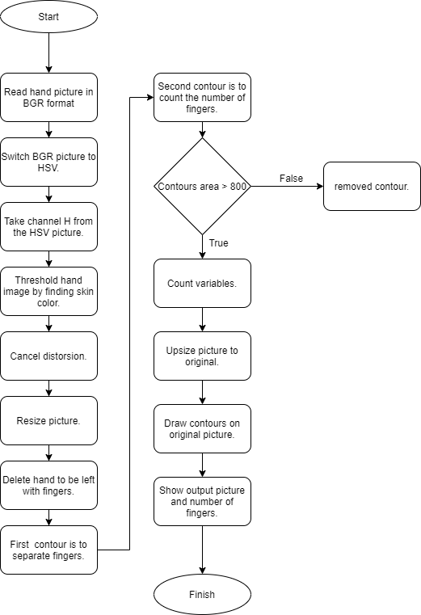

# **Description**
Finger detecter Final.py is a program to recognize the number of finger/fingers on a hand. To do so, we erease the palm of the hand. For further information I have attached a diagram of the project down below. 

# **Installation**
    pip install -r requirements.txt
   
#**Run**

    python Finger\ detecter\ Final.py 

